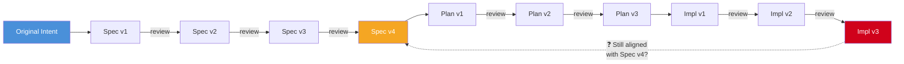

# Baseline Alignment: Detecting Drift Across Review Cycles

## The Problem

Larger features go through multiple rounds of review and revision at every phase: the spec gets reviewed and refined, the implementation plan gets reviewed and adjusted, and the implementation itself goes through PR review cycles with fixes and changes. Each individual revision makes sense in isolation — a reviewer catches an edge case, a constraint surfaces during planning, a test failure prompts a code change.

But without periodically checking back against the **baseline** — the artifact from the previous phase — these incremental changes compound into **drift**. The implementation no longer matches the plan. The plan no longer matches the spec. The spec may have evolved away from the original problem statement.

Drift has two dimensions:

- **Directional drift** — the solution moves *away* from what was intended. Requirements get dropped, simplified, or subtly altered until the implementation no longer serves the original need.
- **Volume drift** — the solution grows *beyond* what was intended. Each review cycle adds "just one more thing" until a simple MVP becomes a fully-featured system that nobody scoped, budgeted, or asked for.



Each arrow is a well-intentioned revision. The danger is that no one checks the diagonal — whether the final implementation still serves the original spec.

## Why This Happens

### Narrowing Focus During Reviews

Reviewers naturally focus on the artifact in front of them. A PR reviewer reads the code diff, not the spec. A plan reviewer reads the plan, not the original problem statement. This is efficient for catching local issues but blind to global drift.

### Accumulation of Small Deviations

No single review comment causes drift. But a series of reasonable changes can:

1. A spec reviewer suggests simplifying a requirement ("we don't need X for v1")
2. The plan accommodates the simplification but also drops a related requirement Y that was tightly coupled
3. The implementation skips Y's test coverage since it's "not in the plan"
4. A PR reviewer asks for a refactor that subtly changes the behavior of Z, which depended on Y

Each step is locally correct. The result is an implementation that has silently dropped a requirement.

### Scope Accumulation Through "Helpful" Suggestions

Volume drift is especially insidious because it feels like improvement. A spec reviewer suggests handling an extra edge case. A plan reviewer recommends adding a caching layer "while we're at it." A PR reviewer asks for a retry mechanism, better error messages, and a metrics dashboard. Each suggestion is reasonable on its own. Nobody is tracking the cumulative cost.

The result: what started as a simple MVP — deliberately scoped to validate an idea quickly — has become a production-grade system with retry logic, caching, observability, and edge-case handling that nobody planned for, tested holistically, or agreed to maintain. The developer may not even realize the scope has doubled because each addition felt small. But every added feature carries ongoing cost: more code to maintain, more tests to keep passing, more surface area for bugs, and more complexity for the next person (or AI) to understand.

This is particularly dangerous in AI-assisted development. AI reviewers are thorough by nature — they will suggest improvements, hardening, and additional coverage. Human reviewers, wanting to add value, pile on suggestions. Without a scope anchor, the artifact absorbs it all.

### Context Loss Across Sessions

When work spans multiple sessions or days, the human and AI both lose context about upstream decisions. The PR reviewer in session 5 wasn't present for the spec discussion in session 1. The AI agent implementing a fix in response to review feedback has no memory of why the plan chose a particular approach.

## The Baseline Alignment Practice

The fix is simple: **periodically check the current artifact against its baseline**.

| Current Phase | Baseline to Check Against |
|---------------|--------------------------|
| Spec revision | Original problem statement / requirements |
| Plan revision | Approved spec |
| Implementation (PR review cycles) | Approved implementation plan |
| Implementation (diagonal check) | Approved spec directly — see [The Diagonal Check](#the-diagonal-check-implementation-against-the-spec) |
| Post-merge validation | Approved spec (full circle) |

### Always Compare Bidirectionally

Every alignment check must analyze from **both directions**. A one-directional check — "does the implementation cover everything in the plan?" — catches directional drift but is blind to volume drift. The reverse question — "does the implementation contain anything not in the plan?" — catches scope creep but misses dropped requirements. You need both.

This applies to every comparison pair:

**Spec vs. Plan:**
1. Does the plan describe the implementation of everything defined in the spec? Anything missing or only partially covered?
2. Does the plan describe things that were never part of the spec? What's the reason — is it a justified technical necessity (e.g., a migration step the spec didn't mention because it's an implementation detail), or is it evidence of scope drift? If justified, should it be added back to the spec to complete the picture?

**Plan vs. Implementation:**
1. Does the implementation address every task in the plan? Anything dropped, deferred, or only partially done?
2. Does the implementation contain functionality that the plan never called for? Was it added during review cycles, and is it justified? Should the plan be updated, or should the addition be deferred?

**Spec vs. Implementation (diagonal check):**
1. Does the implementation fulfill every goal and requirement stated in the spec? Not at the task level (that's plan→impl), but at the intent level — does it solve the problem the spec set out to solve?
2. Does the implementation solve problems the spec never raised? This is the strongest signal of volume drift, because the spec represents the agreed scope. Anything the implementation does beyond the spec was never explicitly agreed to.

For each difference found in direction 2 (artifact contains something the baseline doesn't), the resolution is one of:
- **Backfill the baseline** — the addition is justified; update the upstream artifact to reflect reality and maintain the full picture
- **Defer the addition** — the addition is nice-to-have; remove it from the current work and create a follow-up ticket
- **Flag as drift** — the addition is unjustified and should be removed

### When to Check

- **After every 3rd review cycle** on the same artifact — if a PR has gone through 3+ rounds of review/fix, it's time to check the plan
- **Before phase transitions** — before moving from planning to implementation, verify the plan still covers the spec
- **When a reviewer requests a significant change** — if a review comment leads to more than a localized fix (architectural change, dropped feature, new dependency), check the baseline
- **When resuming after a break** — if days have passed since the last session, re-read the baseline before continuing

### How to Check

#### Manual Check

Re-read the baseline document and compare it against the current state of the artifact. Create a simple alignment checklist:

```markdown
## Baseline Alignment Check

**Artifact**: PR #42 (implementation)
**Baseline**: Implementation plan at docs/plans/feature-x.md
**Trigger**: 4th round of PR review

### Requirements from plan:
- [ ] REST endpoint with pagination — still present, matches plan
- [ ] Redis caching with 5-min TTL — changed to 10-min during review, **intentional** (reviewer flagged perf concern)
- [ ] Error handling with retry — **missing**, dropped during refactor in review round 3
- [ ] Integration test for cache invalidation — **missing**, not written after cache TTL change

### Scope check (items NOT in plan):
- [ ] Retry with exponential backoff — **added** in review round 2 (reviewer suggestion)
- [ ] Prometheus metrics endpoint — **added** in review round 3 (reviewer suggestion)

### Verdict:
- **Directional**: 2 items drifted. Error handling needs to be restored. Integration test needs updating for new TTL.
- **Volume**: 2 items added that weren't in the plan. Decide: defer to a follow-up, or accept and update the plan.
```

#### AI-Assisted Check

Ask the AI to perform the comparison explicitly:

```
Compare the current implementation on this branch against the plan
at docs/plans/feature-x.md.

1. For each item in the plan, verify whether the implementation still
   addresses it. Flag any items that were dropped, changed, or only
   partially implemented.
2. For each piece of functionality in the implementation, verify whether
   it appears in the plan. Flag anything that was added but not planned.
3. For changes and additions, note whether they were intentional
   (documented in review comments) or accidental.
```

This works well because the AI can read both artifacts and do a systematic cross-reference — exactly the kind of tedious-but-important work that humans skip under time pressure.

#### Spec Compliance Review

For the final check (implementation vs. spec), use a structured bidirectional review:

```
Compare the implementation in this PR against the spec at
docs/specs/feature-x.md. Analyze from both directions:

Direction 1 — Spec coverage:
Create a table with columns: Spec requirement | Implementation status
(met / partially met / not met / changed) | Evidence (file:line or test).
Flag any requirement that is "changed" or "not met."

Direction 2 — Scope check:
List any significant functionality in the implementation that the spec
never mentions. For each, note: is it a justified technical necessity,
or potential scope drift?
```

## The Diagonal Check: Implementation Against the Spec

The baseline alignment table above suggests a chain: implementation is checked against the plan, the plan against the spec. But it also pays to **skip the intermediary** and compare the implementation directly against the original spec — even though they operate at very different levels of abstraction.

This is not redundant. The transitive chain (impl→plan→spec) can show "aligned" at every link while the end-to-end result has drifted. The direct diagonal check catches what the chain misses.

### Why the plan is a lossy intermediary

The plan translates spec requirements into technical tasks. That translation is necessarily lossy — it decomposes user-facing intent ("users should see their recent activity") into implementation details ("REST endpoint, React component, Redis cache"). When you check the implementation against the plan, you're verifying that the technical decomposition was executed faithfully. But you're not verifying that the decomposition itself was faithful to the spec.

If a spec requirement was misunderstood, oversimplified, or partially lost during planning, the plan itself becomes a flawed baseline. Checking implementation against a flawed plan produces a false "aligned" signal.

### How compound drift hides in transitive checks

Consider this chain:

1. The spec says: "Display the 10 most recent user actions with timestamps"
2. The plan translates this to: "GET /api/activity endpoint returning recent actions"
3. During plan review, "10 most recent" is quietly generalized to "recent" (a reviewer says "let's not hardcode the limit")
4. The implementation returns the 50 most recent actions (the developer picks a default)
5. During PR review, a suggestion adds pagination support

Checking impl→plan: aligned (the endpoint returns recent actions, as planned). Checking plan→spec: roughly aligned (the plan covers activity retrieval). But the direct impl→spec check reveals: the spec asked for a simple list of 10 items, and the implementation delivers a paginated API returning 50 items with configurable limits. The *direction* is roughly right, but the *volume* ballooned through intermediary drift.

### When to do the diagonal check

The direct impl→spec comparison is most valuable:

- **Before final review approval** — as a last gate, verify the implementation serves the spec's intent, not just the plan's tasks
- **When the plan itself went through heavy revision** — if the plan had 3+ review cycles, it may have drifted from the spec, making it an unreliable intermediary
- **For MVP-scoped work** — MVPs are deliberately minimal; the spec captures that intent, but the plan and implementation tend to absorb complexity. The diagonal check asks: "is this still an MVP?"

### The abstraction gap is a feature

The spec and the implementation operate at very different levels of abstraction. This makes comparison harder — but it's precisely what makes it valuable. Comparing code against technical tasks (impl→plan) stays in the "how" domain. Comparing code against the spec forces you back into the "what" and "why" domain: does this actually solve the user's problem? Is it solving more than was asked for? Is it solving the right problem at all?

An AI-assisted diagonal check works well here because the AI can bridge the abstraction levels:

```
Compare the implementation on this branch against the original spec at
docs/specs/feature-x.md. Ignore the implementation plan — I want to
know whether the code, as built, serves the spec's stated goals.

For each goal in the spec:
1. Is it met by the implementation?
2. Is it met in the way the spec intended, or has the approach diverged?

Also flag any significant functionality in the implementation that
the spec never asked for.
```

## Intentional vs. Accidental Drift

Not all drift is bad. Sometimes a review cycle reveals that the spec was wrong, or the plan was over-engineered, or a simpler approach emerged during implementation. The point of baseline alignment is not to rigidly enforce the original plan — it's to make drift **visible and intentional**.

When you detect **directional drift** (something changed or dropped):

1. **If intentional**: Document the deviation and update the baseline. If the implementation intentionally diverges from the plan, update the plan (or add a note explaining the divergence). If the plan diverges from the spec, update the spec.
2. **If accidental**: Restore the original intent. Re-implement the dropped requirement, restore the removed test, or fix the behavioral change.

When you detect **volume drift** (something added beyond scope):

1. **Ask whether it belongs in this iteration.** The addition may be valuable, but was it part of the agreed scope? If the original intent was an MVP, every addition delays validation of the core hypothesis.
2. **Make the cost visible.** Each added feature carries ongoing cost: code to maintain, tests to keep passing, documentation to write, surface area for bugs, and complexity for the next person to understand. A reviewer suggesting "add retry logic" may not realize the implementation also needs backoff configuration, tests for each retry scenario, logging, and metrics — turning a one-line suggestion into a multi-day addition.
3. **Defer or accept explicitly.** If the addition is worth keeping, update the plan and spec to reflect the expanded scope. If it's nice-to-have, create a follow-up ticket and remove it from the current PR. Never let scope grow silently.

The worst outcome is **undocumented drift** — whether directional or volumetric. Undocumented directional drift means everyone informally agrees the spec is outdated but nobody updates it. Undocumented volume drift means the solution carries cost that was never budgeted or agreed to. Both create debt that compounds over time and misleads future AI sessions and new team members.

## Integrating Into Your Workflow

### CLAUDE.md Rule

Add a baseline alignment reminder to your project's CLAUDE.md:

```markdown
## Review Cycle Discipline

- SHOULD perform a baseline alignment check after 3+ review rounds on the same PR
- SHOULD compare implementation against the plan before requesting final review approval
- MUST update the plan/spec when intentional deviations are identified during alignment checks
```

### PR Template Addition

Add a section to your PR template for larger features:

```markdown
## Baseline Alignment

- [ ] Implementation matches the plan at [link to plan]
- [ ] Any intentional deviations are documented below
- [ ] Plan/spec updated to reflect intentional changes

### Deviations from Plan
<!-- List any intentional changes from the original plan, with rationale -->
```

### Multi-Session Features

For features spanning multiple sessions, baseline alignment is especially important. Add it to the [start-of-session protocol](multi-session-patterns.md):

1. Read the progress file
2. Read the feature list
3. **Re-read the plan and verify the last session's work still aligns**
4. Run baseline tests
5. Continue work

### Review Skills / Automation

If your team uses AI-assisted PR reviews, configure the review to include a baseline check. A review skill can automatically compare the PR diff against a linked spec or plan and flag potential drift in its review output.

## Signs You Need a Baseline Check

**Directional drift signals:**
- A reviewer asks "was this in the spec?" and you're not sure
- You can't remember why a particular approach was chosen
- Test coverage has decreased during review-driven refactors
- The implementation "works" but you've lost track of whether it covers all original requirements

**Volume drift signals:**
- The PR diff is significantly larger than you expected from the plan
- You're implementing features that weren't in the plan "because a reviewer suggested it"
- The delivery estimate has grown but nobody adjusted the scope
- You find yourself writing tests for functionality you don't remember planning

**General signals:**
- A PR has been open for more than a week with active review cycles
- The PR description no longer accurately describes the changes
- When resuming after a break, the branch feels unfamiliar

## Anti-Pattern: The Telephone Game

**Pattern**: Spec is reviewed and changed. Plan is written from the changed spec, then reviewed and changed. Implementation is written from the changed plan, then reviewed and changed. At no point does anyone check whether the final implementation still satisfies the original spec.

**Why it's bad**: Like the children's game of telephone, the message degrades with each retransmission. Requirements get dropped, simplified, or subtly altered at each phase transition and within each review cycle. By the end, the feature may technically "work" but miss the original business need.

**Better approach**: Treat baseline alignment as a hygiene practice — quick, routine, and non-negotiable for larger features. The cost of a 10-minute alignment check is trivial compared to discovering post-merge that a key requirement was silently dropped three review cycles ago.

## Anti-Pattern: The Helpful Reviewer Snowball

**Pattern**: An MVP spec goes through review. A reviewer suggests adding error handling for an edge case. Another suggests a caching layer. During plan review, someone adds observability. During PR review, the AI suggests retry logic, a reviewer asks for rate limiting, and another requests configurable timeouts. Each suggestion is accepted because it's individually reasonable. Nobody tracks the cumulative scope change.

**Why it's bad**: The MVP was scoped to validate a hypothesis quickly. Instead, it ships as a production-hardened system that took 3x longer to build. The extra functionality was never budgeted, tested as a whole, or evaluated against the original goal. Worse, the developer may not even notice the scope doubled — each addition felt like "just a small thing." The hidden cost is not just the build time but the ongoing maintenance burden: every added feature needs tests, documentation, monitoring, and future compatibility consideration.

**Better approach**: During every baseline alignment check, compare in both directions — not just "did we miss anything from the plan?" but also "did we add anything that wasn't in the plan?" For additions, explicitly decide: defer to a follow-up ticket, or accept and update the plan with the expanded scope and timeline. Treat "we should also..." suggestions as scope change proposals, not free improvements.

## See Also

- [Development Lifecycle Overview](overview.md) — the 5-phase cycle and phase transitions
- [Phase 4: Validation](04-validation.md) — verification patterns including spec traceability
- [Multi-Session Patterns](multi-session-patterns.md) — state persistence across sessions
- [Anti-Patterns](../05-guardrails/anti-patterns.md) — common process mistakes
- [MUST Rules](../05-guardrails/must-rules.md) — non-negotiable requirements
