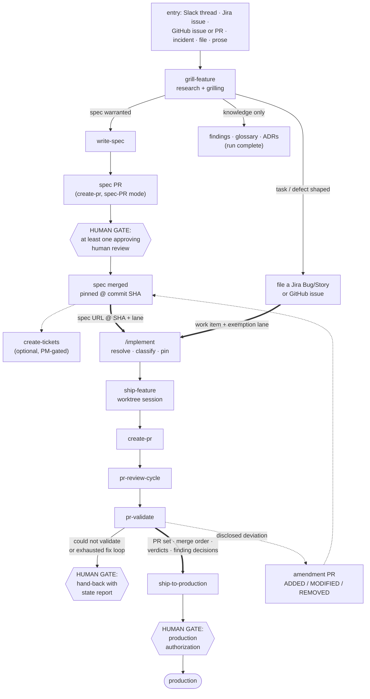

# The Delivery Pipeline

How the three stages of spec-driven delivery — research to spec, work item to pull request, pull
request to production — fit together: what each stage produces, what crosses each boundary, and
where humans decide. Each stage has its own design document; this page is the map that connects
them.

| Stage | What it covers | Design of record | Status |
|---|---|---|---|
| 1 · First mile | Research, spec writing, optional ticket creation | https://github.com/adobe/mysticat-ai-native-guidelines/pull/47 | Draft |
| 2 · Middle | Implementation, PR, review, pre-merge validation | [Implementation Delivery Chain](../plans/2026-08-12-implementation-delivery-chain-design.md) | Draft |
| 3 · Last mile | Merge, deploy, environment validation, promotion | https://github.com/adobe/mysticat-ai-native-guidelines/pull/45 | Draft |
| — | Orchestration discipline all three follow | https://github.com/adobe/mysticat-ai-native-guidelines/pull/46 | In review |

The middle stage is implemented in
https://github.com/adobe/experience-success-skills/pull/160 ;
the other two are designs.

## The pipeline

## What crosses each boundary

The pipeline is three procedures joined by two hand-off objects and one return edge. Nothing else
crosses.

**First mile → middle: a work item.** Either a merged spec resolvable to a pinned commit SHA,
carrying its lane (light or full) and a machine-readable block naming repos, branches, edges, and
merge order — or, on the task/defect exit, a filed Jira Bug/Story or GitHub issue that rides the
exemption lane and never gets a spec. The knowledge-only exit terminates the pipeline before the
middle: findings, glossary entries, and ADRs are the whole output, and that is a completed run.

**Middle → last mile: a validated PR set.** Open PRs with merge order stated (rendered from
work-package edges when a spec defines them, hand-written otherwise), a recorded `pr-validate`
verdict per PR, every review finding carrying a decision, and auto-merge disarmed.

**The return edge: amendments.** An intentional deviation disclosed during implementation, or a
post-merge learning, becomes an amendment PR against the spec expressed as
ADDED / MODIFIED / REMOVED deltas — the spec stays the design of record instead of drifting away
from the code.

## Human gates

The pipeline is agent-run by design, and precisely because of that, the places where a person
decides are explicit. Per the orchestration guide, sub-agents cannot ask the user — so every gate
below is main-thread work, and a delegated agent can only escalate to it.

| # | Gate | Rule |
|---|---|---|
| 1 | Research decisions | Facts come from evidence; decisions belong to the human. `grill-feature` asks with recommended answers, and the chosen exit (spec / task-defect / knowledge) is a recorded decision. |
| 2 | **Spec PR approval** | Every spec PR requires **at least one approving human review** before it merges. Bot review does not satisfy this gate. Specs are the contract everything downstream builds on; no one builds on an unread contract. |
| 3 | Ticket creation | Optional and PM-gated: `create-tickets` runs only for work whose PM requires Jira tracking. |
| 4 | Clarifying questions during implementation | A human answers; agents propose. Delegated per-question only once a written decision policy can answer it. |
| 5 | **Unverifiable PR** | A `could not validate` outcome goes back to a human. The pipeline never proceeds past validation on its own: the human supplies the missing environment or evidence, records an accepted-risk skip under their own name, or holds the PR. |
| 6 | **Unfixable defect** | When a defect is found and the fix loop cannot resolve it within its attempt caps, a human is required. The run ends in a named hand-back with a state report — never a silent stop, never a rounded-up success. |
| 7 | Code PR merge | Human approval per branch protection; the review cycle never arms auto-merge. |
| 8 | **Production authorization** | Human, per promotion — deliberately last, possibly never automated. |

Gates 1, 3, 4, and 7 are candidates for policy-based delegation with explicit flip criteria (the
first-mile design's decision-policy layer). Gates 2, 5, 6, and 8 are not.

## What a spec must be

The unified spec contract (first-mile design, Phase 1) governs structure — frontmatter,
EARS requirements, work-package table, machine-readable block, acceptance criteria red at base.
Two requirements sit above the structure:

- **Specs MUST be written in plain human language.** The machine-readable block exists so agents
  never parse prose; the prose therefore exists for people, and is written for them — short
  sentences, defined terms, no pipeline jargon a new reader would not know. A spec that only its
  toolchain can read fails review.
- **Everything diagrammable MUST be diagrammed.** Flows, state machines, topologies, and boundary
  hand-offs carry a Mermaid diagram next to the prose that describes them. The diagram and the
  prose must agree; the human reviewer (gate 2) reads both.

## The three lanes through the middle

The middle stage accepts more than specs. `/implement` (the renamed `implement-spec`) classifies
the input and hands the lane to `ship-feature`:

| Lane | Input | What changes |
|---|---|---|
| Feature | Spec URL, pinned to a commit SHA | Full phase set: exploration, architecture panel, implementation, review, verification |
| Task | GitHub issue · Jira Story (no spec) | Architecture panel replaced by a single design sanity pass; PR carries the `Exemption:` bullet |
| Defect | Jira Bug · defect-labelled issue | Reproduce first; regression test red at base; no architecture panel; PR carries the `Exemption:` bullet |

Unversioned inputs (issue bodies) are snapshot-pinned by content hash so the text cannot change
under the run — the same property SHA-pinning gives a spec.

## Verification, in four layers

Four different things called "verification" happen at four different points; they are not
interchangeable:

1. **Spec validation** (first mile): lint, claim verification, coverage checks, adversarial panel,
   acceptance criteria provably failing at base — before the spec merges.
2. **Local verification** (middle, before the PR opens): scoped tests, repo gates, and — where the
   workspace `local/` harness covers the service — an autonomous end-to-end loop against the local
   stack, asserting on production data shapes.
3. **Pre-merge validation** (`pr-validate`): the change exercised on the live environment serving
   the branch, recorded as a PR comment with one of four verdicts —
   `validated / defect found / could not validate / skipped` — never rounded up.
4. **Post-merge validation** (last mile): the same verdict vocabulary applied per environment
   boundary after each deploy, with the comment as the deliverable.

The verdict vocabulary is defined once, in the middle-stage design of record; the other stages
reference it.

## How this maps to the 5-phase lifecycle

The [lifecycle overview](overview.md) describes the general 5-phase development cycle. For
pipeline-driven work the phases map onto the stages like this:

| Lifecycle phase | Pipeline home |
|---|---|
| 1 · Design & Spec | First mile: `grill-feature` → `write-spec` → spec PR (human-reviewed, merged) |
| 2 · Planning | The spec's work-package table and machine-readable block; optionally `create-tickets` |
| 3 · Implementation | Middle: `/implement` → `ship-feature` → `create-pr` |
| 4 · Validation | Middle: `pr-review-cycle` → `pr-validate`; last mile: per-environment validation |
| 5 · Closure | Last mile: promotion and validation comments; amendments back into the spec; Jira transitions |

The pipeline replaces the manual template-copy step of phase 1 for any work that enters through
it; the 5-phase model remains the frame for work that does not.

## Related documents

- [Lifecycle Overview](overview.md) — the general 5-phase cycle
- [Design & Spec](01-design-spec.md) — spec iteration practices
- [Multi-Session Patterns](multi-session-patterns.md) — worktree isolation the middle stage builds on
- Agent orchestration guide (PR 46) — spawn shapes and the delivery contract:
  https://github.com/adobe/mysticat-ai-native-guidelines/pull/46
