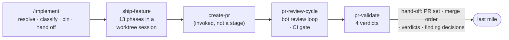
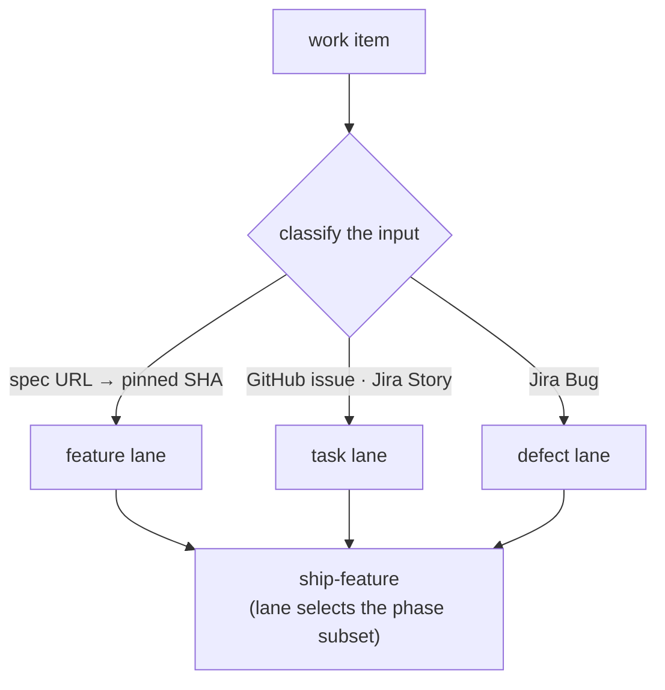

# Implementation Delivery Chain — Design of Record and Extensions

| Field | Value |
|---|---|
| **Status** | Draft |
| **Author** | Rainer Friederich |
| **Created** | 2026-08-12 |
| **Updated** | 2026-08-12 |
| **Decided** | — |
| **Approvers** | — |
| **Jira** | N/A (epic to be filed on adoption) |

## Summary

The middle stage of the delivery pipeline — the chain that takes a merged work item and drives it
through implementation, PR creation, review, and pre-merge validation — is implemented in
https://github.com/adobe/experience-success-skills/pull/160
but has no design of record: its contracts exist only as prose spread across five `SKILL.md` files,
and the two pipeline designs on either side of it constrain it by quotation. This document is that
design of record, written retroactively against the implemented state, plus four extensions the
implemented chain does not yet have: **work-item lanes** (a task lane and a defect lane beside the
existing feature lane, with Jira accepted as an input), **exemption wiring** (the chain emits the
no-spec exemption its own review gate parses), **local-first verification** (the workspace `local/`
harness becomes a standard verification step before a PR opens), and **human gates** stated
explicitly (which decisions stay with a person, and under what condition each could ever be
delegated).

All contract references to the implemented chain are pinned to commit
`8753adb5f1575e7bfc5b44379ae3da40a79c1b4a` of that PR's branch. The PR is in active review; every
pinned reference MUST be re-verified against the merged state before any phase of this document is
implemented.

## Problem Statement

The chain `/implement → ship-feature → create-pr → pr-review-cycle → pr-validate` is real,
large (five skills, the largest 1626 lines), and in review — but:

- **Its contracts have no normative home.** The four-verdict vocabulary
  (`validated / defect found / could not validate / skipped`) has three consumers across three
  documents and no owner. The PR-body section numbering that two designs reference ("section 4",
  "section 9") is defined only inside the `create-pr` skill's bundled template. Where `create-pr`
  itself sits is described three incompatible ways across the surrounding documents.
- **Non-spec work has no route.** A GitHub issue is accepted as input (the issue body is treated
  as the spec), but it gets no pinned revision, falls into interactive repo inference, and meets a
  phase set shaped for features — a one-line defect fix still convenes a multi-agent architecture
  panel. A Jira bug has no route into the chain at all, although the first-mile design's
  task/defect exit files exactly those.
- **The chain's own no-spec PRs are classified as degraded.** The review side parses two exemption
  channels — a `no-spec-needed` label and an `Exemption: <reason>` bullet in PR-body section 4 —
  and nothing in the implementing chain writes either. A legitimate no-spec PR produced by this
  pipeline is labelled `degraded` by its own grounding metric.
- **Local verification is under-specified.** The "verify it actually runs" phase reaches for a
  generic run skill, while the workspace `local/` harness already offers three fully autonomous
  cross-service verification loops that nothing in the chain uses.
- **Human gates are implicit.** Which steps require a person — and which are agent-run with a
  person merely able to intervene — is nowhere stated.

## Goals

- Record the implemented chain's external contracts as the design of record: entry contract, spec
  interface, exemption channels, verdict vocabulary, completion gates, and the hand-off object at
  each boundary.
- Take normative ownership of the contracts that today have consumers but no owner: the verdict
  vocabulary, the three-gate completion rule, the PR-body section numbering, and `create-pr`'s
  position in the chain.
- Add a **task lane** and a **defect lane** beside the feature lane, dispatched by input
  classification in one entry skill — including Jira issues as a first-class input shape.
- Wire the **exemption channels**: runs on the task and defect lanes emit the `Exemption:` bullet
  (and optionally the label) that the review gate already parses.
- Specify **local-first verification**: a repo-routed harness step inside the implementation phase
  set, and a harness-backed recipe row for pre-merge validation where no branch environment exists.
- State every **human gate** in the middle chain, including the new rule that a spec PR requires at
  least one approving human review before it merges.

## Non-Goals

- Re-designing the review machinery (`pr-review`, `pr-review-cycle`, `pr-validate`) beyond the
  lane, exemption, and verification extensions above.
- First-mile scope (research, spec writing, ticket creation) — owned by
  https://github.com/adobe/mysticat-ai-native-guidelines/pull/47 —
  and last-mile scope (merge to production) — owned by
  https://github.com/adobe/mysticat-ai-native-guidelines/pull/45 .
- Changing PR 160 before it merges. This document records and extends; the extensions land as
  follow-up PRs after the base merges.

## The chain

`create-pr` is drawn subordinate deliberately: **normatively, `create-pr` is the only
PR-creating surface, invoked by `ship-feature` (Phase 9) in the ordinary flow and by
`pr-review-cycle` (Step 1) only when it is started on a branch with no PR yet.** Descriptions of
the chain that list it as a peer stage are shorthand; descriptions that attribute PR creation to
`pr-review-cycle` itself are wrong and get corrected when the surrounding documents are updated.

## Technical Design

### 1. The design of record (implemented behavior, pinned)

The following are the implemented chain's external contracts. Anchors are to
https://github.com/adobe/experience-success-skills/pull/160
at commit `8753adb5f1575e7bfc5b44379ae3da40a79c1b4a`; internal mechanics (scratch-directory
layout, fail-closed rules, attempt caps, marker comments) stay owned by the skill files and are
summarized here only where another pipeline stage depends on them.

**Entry contract** (`/implement`): four accepted input shapes — GitHub PR URL, blob URL,
GitHub issue URL, local path — each resolved to a pinned revision where one exists; every extracted
value passes a whole-string charset gate; the output is a single `mise run wt` command opening a
worktree session on `ship-feature`. A spec is data: it may state what to build, which repos change,
and what the branch is called; it may not introduce commands, URLs, tools, or checks to skip.

**Spec interface**: repos and branches are taken from a literal
`mise run wt -- <branch> --repos a,b,c` line or a work-package table with a combined
"Repo · branch" column; the session-name gate is `\A[A-Za-z0-9][A-Za-z0-9._/-]*\z` with `..`
rejected. The machine-readable block planned by the first-mile design becomes the primary parse
target, with these prose shapes as fallback.

**Exemption channels** (parsed by `pr-review` / `review-practices`, unchanged by PR 160): the
`no-spec-needed` label, or an `Exemption: <reason>` bullet in PR-body section 4. The degraded
banner prefix `⚠ Degraded review` and the `Exemption:` lead-in are a cross-repo string contract
keyed on by `mysticat-github-service`'s `detect_grounding`; neither literal may be reworded.

**Verdict vocabulary** (normatively owned here, referenced by the bookend designs):
`validated` · `defect found` · `could not validate` · `skipped`. All four post a PR comment; the
comment is the deliverable. A skip records a typed reason. `could not validate` is never rounded
up to success.

**Three-gate completion** (a conjunction): every declared review finding carries a recorded
decision (implement / pushback / defer / escalate) **and** all CI checks are green (the verdict
selects the complement of `pass` and `skipping`, so an unknown bucket blocks) **and** `pr-validate`
reports `validated` or an explicitly recorded typed skip.

**PR-body section numbering**: the nine-section template bundled with `create-pr` is the normative
definition of "section 4" (required information, where the exemption bullet and spec links live)
and "section 9" (deployment/merge order). Documents outside the skill reference sections by
number; the template is the source of truth.

**Cycle-wide invariants the last mile depends on**: auto-merge is disarmed for the whole cycle and
never re-armed (whatever ends the run reports it); merge order for a PR set is stated, never
inferred from timestamps.

### 2. Work-item lanes

One entry skill — **`/implement`** — dispatches by input classification; the lane travels in the
hand-off to `ship-feature` and selects the phase subset. The chain is not merged anywhere yet, so
the name carries no compatibility burden: the entry skill is `/implement` from the start, named
for what it does now that non-spec inputs are first-class.

- **Feature lane** (implemented today): full phase set — exploration, architecture panel,
  implementation, review gate, verification, PR.
- **Task lane** (new): for GitHub issues and Jira Stories without a spec. Skips the architecture
  panel (a single design sanity pass replaces it); all quality, verification, and review phases
  remain. The PR carries the `Exemption:` bullet.
- **Defect lane** (new): for Jira Bugs and defect-labelled GitHub issues. Adds two requirements
  the feature lane does not have — **reproduce first** (the run demonstrates the failure before
  changing code) and **regression test red at base** (the test that covers the fix fails on the
  base commit and passes on the branch). Skips the architecture panel. The PR carries the
  `Exemption:` bullet.

**Jira as an input shape** (new): a Jira issue URL or key resolves via the Atlassian MCP; issue
type selects the default lane (Bug → defect, Story/Task → task). Repos are taken from the issue
when stated, otherwise inferred interactively exactly as for GitHub issues today.

**Pinning unversioned inputs** (new): a GitHub or Jira issue body has no commit SHA. The entry
skill snapshots the body into the session hand-off and records its content hash; `ship-feature`
works from the snapshot, so the text cannot move under the run — the same property SHA-pinning
gives a spec.

### 3. Exemption wiring

The lane decides the grounding declaration, and `create-pr` writes it:

- Feature lane → section 4 carries the spec link (existing behavior).
- Task and defect lanes → section 4 carries `Exemption: <reason>` where the reason names the work
  item (`Exemption: defect fix for SITES-12345 - no spec required`). Applying the
  `no-spec-needed` label is optional and secondary; the bullet is the load-bearing channel because
  the label requires repo-level permissions the bullet does not.

This closes the false-degraded defect: the pipeline's own no-spec PRs are classified `exempt` by
the same parser that today classifies them `degraded`.

### 4. Local-first verification

The workspace `local/` harness (driven by the `local-dev` skill in `adobe/mysticat-workspace`)
is the verification **infrastructure**, not just a set of scripts: it runs the services
(api-service, data-service/PostgREST, projector, mystique, DRS in mock mode, elmo-ui),
provisions LocalStack (SNS/SQS/S3/DynamoDB), loads fixture data (tenant seeds, the Serenity mock
seed, cross-service e2e seeds), and stands up contract-pinned Semrush vendor mocks with
seed/reset/dump control routes. On that infrastructure the agent self-verifies in two forms.

**Interactive self-verification** — the agent drives the running stack directly:

- call the local api-service and data-service (PostgREST) HTTP APIs against seeded fixtures;
- exercise the Semrush mock APIs directly (seed → call → assert, `__reset` between scenarios);
- drive the UIs — elmo-ui and the ASO UI — through a browser (Chrome DevTools MCP) against the
  local API, in the harness's local auth mode;
- inject events (SQS/SNS fixtures) and read the results through both the data plane and the API.

**Packaged loops** — the pre-built autonomous recipes, used as gates:

| Loop | What it proves | Command |
|---|---|---|
| Flow A | API → projector → opportunity, cross-service | `make smoke-audit-to-opportunity` |
| Flow B′ | reply-consumer → data-service → API, offline and deterministic | `make smoke-reply-to-opportunity` |
| Semrush-mock path | API through contract-pinned vendor mocks against a seeded org | `make up-semrush-mocks` + seeded curl checks |

Two insertion points:

- **`ship-feature`, "verify it actually runs" phase**: when the change touches a service the
  harness can run, the verification step SHOULD use the matching harness loop instead of (or in
  addition to) the generic run skill, routed by a repo → recipe table. Scoped tests and repo
  gates remain unchanged.
- **`pr-validate`, per-repo recipe table**: repos that deploy nothing before merge (today skipped
  with "evidence still owed") gain a harness-backed local recipe, converting the typed skip into a
  real pre-merge check where the harness covers the surface.

Constraints the recipes MUST state:

- **Session isolation (required)**: each concurrent worktree session (`mise run wt`) MUST be able
  to run its own harness instance — service ports and URLs parameterized per session, per-session
  env and PID state, and a per-session compose project, so one session's reset cannot destroy
  another session's data. Today the harness shares one `local/.env`, one PID directory, and one
  compose project across all sessions, so verification serializes (one session at a time,
  releasing with `make stop-services`); that serialization is the interim rule only, and the
  isolation work in `mysticat-workspace` is a Phase 3 deliverable.
- **Production-shape assertions**: the local reply-consumer stores the whole SQS envelope, so a
  field lands at `data.data.<field>` locally but `data.<field>` in production; assertions target
  the production shape or they are a false green.
- **Boundaries**: anything IMS-, Vault-, or klam-backed (UI flows, real-data clones, the
  ECR-gated integration suite) stays outside the autonomous step; the LLM-dependent Flow B is not
  a usable gate until its upstream fixes land.

### 5. Human gates

| Gate | Who decides | Delegation condition |
|---|---|---|
| Spec PR approval | **At least one human approving review, always** — the bot review does not satisfy this gate; `pr-review-cycle` MUST NOT treat a spec PR as review-complete without it. Approval also asserts that every open question tagged *before implementation* is resolved or explicitly re-phased | None planned; specs are the contract everything downstream builds on |
| Questions arising during implementation | Human answers; agents may propose. This gate covers only what the implementation newly surfaces — a spec's own open questions are settled before the spec PR is approved (previous row), so reaching this gate for a question the spec already listed is a spec-review failure, not a normal event | Per-question, once the first-mile decision-policy layer can answer it with a written policy |
| Review-finding pushback that stalls (escalate outcome) | Human arbitrates | None; escalation is by definition the human path |
| `could not validate` on a PR | **Goes back to a human** — the run does not proceed past the validation gate on its own; the human either supplies the missing environment/evidence, records an accepted-risk typed skip under their name, or holds the PR | None; an unverifiable change is precisely what a person must own |
| Defect found that the fix loop cannot resolve within its caps | **Human required** — when the review or CI fix loop exhausts its attempt budget, or a validation defect has no in-loop fix, the run ends in a named hand-back to a human with the state report, never a silent stop | None; the caps exist to force this hand-back |
| Code PR merge | Human approval per repo branch protection; the cycle never arms auto-merge | Governed by the last-mile design, not this one |
| Production authorization | Human whenever the production deploy risk is high **or** the change promotes together with other changes (a batched promotion is always authorized by a person) | Low-risk single-change promotions are the only delegation candidate; the flip criterion is owned by the last-mile design |
| Post-deploy anomalies | **A human is alerted as soon as possible** when, after a production deploy, log watching, error reports in the Slack channels, Splunk, or uptime monitoring surface anything new | None; the alerting duty is unconditional |

Everything else in the chain — exploration, implementation, review triage with recorded outcomes,
CI shepherding, validation — runs agent-side by design, with every human gate structurally
main-thread per the agent orchestration guide (subagents cannot ask the user).

### 6. Merge-order transition

Today the merge order of a PR set lives in PR-body section 9 as prose, and the last mile refuses
to guess when it is absent. The first-mile design renders that section from work-package edges in
the spec's machine-readable block. During the transition both are valid, with a strict precedence:
**when the spec defines a machine-readable block, section 9 is rendered from it and the block
wins; when there is no spec or no block, hand-written section 9 prose remains the source of
truth.** The last mile reads section 9 either way and never needs to know which regime produced it.

### 7. Byproduct findings

Errors or warnings that are **unrelated to the work item** but become visible during a run — in
an API response, a UI, or logs, at any phase from exploration through local verification to
`pr-validate` — are tracked, not dropped and not fixed in-scope:

- The finding is filed as a work item with the evidence attached (log excerpt, reproduction
  steps, run link): a Jira Bug for defects, a Story or GitHub issue otherwise, per the receiving
  repo's conventions.
- The current run's scope does not expand: the fix, if any, re-enters the pipeline through the
  task/defect lane as its own run.
- The filed key or issue link is named in the run's report (the `ship-feature` summary or the
  `pr-validate` comment), so the observation and its tracking are auditable together.
- Silently dropping such a finding is a defect of the run's report, the same class as rounding
  up a `could not validate`.

## Implementation Phases

- **Phase 0 — Gate.** PR 160 merges. Every pinned contract reference in this document is
  re-verified against the merged state; drift is corrected here before any extension lands.
- **Phase 1 — Lanes.** The entry skill takes its name `/implement` and gains input
  classification, the Jira input shape, and snapshot-pinning for unversioned inputs;
  `ship-feature` gains the task and defect lane phase subsets.
- **Phase 2 — Exemption wiring.** The lane travels in the hand-off; `create-pr` renders the
  `Exemption:` bullet for the task and defect lanes.
- **Phase 3 — Local-first verification.** The repo → recipe routing table lands in
  `ship-feature`'s verification phase; harness-backed recipes are added to `pr-validate`'s
  per-repo table where they convert a typed skip into a check; and the harness gains per-session
  isolation in `mysticat-workspace` (parameterized ports and URLs, per-session env, PID state,
  and compose project) so concurrent worktree sessions verify independently.
- **Phase 4 — Spec-PR human gate.** `pr-review-cycle` learns to recognize a spec PR (the
  spec-PR-mode exemption form) and blocks review-completion until an approving human review
  exists.
- **Phase 5 — Merge-order precedence.** Lands together with the first-mile design's
  machine-readable block work, in whichever order that ships; this document only fixes the
  precedence rule.

Phases 1–4 are independent of each other and of the first-mile phases; Phase 5 is coupled to the
first-mile Phase 3.

## Alternatives Considered

| Alternative | Why not |
|---|---|
| A separate `implement-task` / `implement-bug` skill beside `/implement` | ~90% of the entry skill is input-shape-agnostic (charset gates, session naming, collision handling, hand-off composition); a parallel skill duplicates all of it and doubles the maintenance surface. The dispatch pattern half-exists already — GitHub issues are an accepted input today. |
| Normalize every task/bug into a minimal "light spec" and feed it through the feature lane unchanged | Contorts the spec contract to cover things that are not specs, and still leaves the defect-shaped requirements (reproduce first, regression test red at base) with no home. |
| Leave the exemption channels unwired and let operators add the label by hand | The measured failure mode is silent: nobody adds it, and the grounding metric misclassifies the pipeline's own output. A manual step that is always forgotten is not a design. |
| Status quo on verification (generic run skill only) | Three autonomous cross-service loops already exist and go unused; the generic path proves "a process starts", not "the change works end to end". |

## Decision Rationale

The middle chain is the pipeline's largest artifact and its contracts already have three external
consumers quoting them; writing the design of record now, pinned to a stated commit with a
re-verify gate, is cheaper than letting a fourth consumer freeze another paraphrase. The lane
model follows the evidence rather than symmetry: the entry skill was already a dispatcher in all
but name, so the design extends its table instead of multiplying skills. The exemption wiring and
the spec-PR human gate are both one-way-door corrections: without them the pipeline mislabels its
own output and could merge the documents everything else builds on without any person having read
them.

## Success Criteria

- Every contract quoted by the bookend designs resolves to a section of this document, and the
  three known contradictions (create-pr's position, merge-order precedence, verdict-vocabulary
  ownership) are resolved by it.
- A Jira Bug reaches a merged fix through the chain with: a reproduction demonstrated before the
  fix, a regression test red at base, and a PR classified `exempt` (not `degraded`) by the
  grounding metric.
- A change to a harness-covered service is verified by the matching autonomous loop before its PR
  opens, and the recipe's assertion targets the production data shape.
- An agent can self-verify a change interactively against the local stack — calling the local
  APIs, driving the UIs through a browser, and exercising the vendor mocks over seeded fixtures —
  without any human-auth step.
- Two concurrent worktree sessions verify independently, each on its own ports and data, once the
  per-session isolation lands.
- No spec PR merges without an approving human review, and the cycle blocks rather than rounds
  up when one is missing.
- Every `could not validate` outcome and every exhausted fix loop ends in a named hand-back to a
  human with a state report — never a silent stop and never a rounded-up success.
- An unrelated error or warning observed during a run is traceable from the run's report to a
  filed work item with evidence attached — no byproduct finding is dropped.

## Dependencies

**External**

- https://github.com/adobe/experience-success-skills/pull/160 — the implemented chain; Phase 0
  gates on its merge.
- The workspace `local/` harness and `local-dev` skill in `adobe/mysticat-workspace` — the
  verification infrastructure, its fixture seeds and vendor mocks, and the per-session isolation
  work Phase 3 requires of it.
- Atlassian MCP availability in the implementing session — the Jira input shape.

**Internal**

- https://github.com/adobe/mysticat-ai-native-guidelines/pull/47 — the first-mile design: the
  task/defect exit that produces this chain's non-spec inputs, the machine-readable block, and
  the create-pr spec-PR mode this document's spec-PR gate keys on.
- https://github.com/adobe/mysticat-ai-native-guidelines/pull/45 — the last-mile design consuming
  the exit contract recorded here.
- https://github.com/adobe/mysticat-ai-native-guidelines/pull/46 — the orchestration guide whose
  spawn-shape and human-gate constraints this chain follows.

## Risks

| Risk | Mitigation |
|---|---|
| PR 160 is still converging; pinned contracts drift before merge | Phase 0 re-verifies every pinned reference against the merged state; nothing builds on the pins before that |
| Lane misclassification (a large change arrives as a "task" and skips architecture) | Classification is a recorded decision the operator sees in the hand-off; the ship-feature quality gate and review cycle still apply on every lane |
| Local-harness false greens (envelope shape, shared ports) | The recipe constraints are normative: production-shape assertions are part of the recipe, sessions serialize until the per-session isolation lands, and independently thereafter |
| The spec-PR human gate is bypassed by merging outside the cycle | Branch protection owns the hard guarantee; the cycle's gate is the pipeline-side check, and the overview document states the rule for humans too |

## Open Questions

- Should the defect lane's reproduce-first step be allowed to use the local harness loops as the
  reproduction environment, making Phase 3 a dependency of Phase 1? *(during implementation)*
- Does the task lane apply to Jira Tasks (which team convention only allows under a Story), or
  are those always routed to their parent Story? *(before implementation)*
- Who applies the `no-spec-needed` label when the bullet alone is deemed insufficient — the
  cycle, or a repo automation? *(out of scope until a consumer requires the label)*

## References

- Implemented chain (pinned): https://github.com/adobe/experience-success-skills/pull/160 at
  `8753adb5f1575e7bfc5b44379ae3da40a79c1b4a` — `skills/feature-delivery/skills/implement-spec/SKILL.md`,
  `skills/feature-delivery/skills/ship-feature/SKILL.md`,
  `skills/review-kit/skills/pr-review-cycle/SKILL.md`,
  `skills/review-kit/skills/pr-validate/SKILL.md`, `skills/review-kit/references/finding-triage.md`.
- First mile: https://github.com/adobe/mysticat-ai-native-guidelines/pull/47
- Last mile: https://github.com/adobe/mysticat-ai-native-guidelines/pull/45
- Orchestration guide: https://github.com/adobe/mysticat-ai-native-guidelines/pull/46
- Pipeline overview: [The Delivery Pipeline](../02-lifecycle/delivery-pipeline.md)
- Local harness: `adobe/mysticat-workspace` — `local/Makefile`, `.claude/skills/local-dev/SKILL.md`,
  `mysticat-architecture/platform/ops/local-dev-e2e-repeatability.md`.
